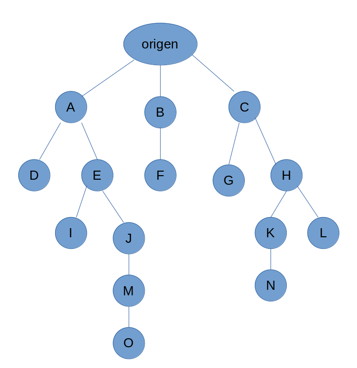
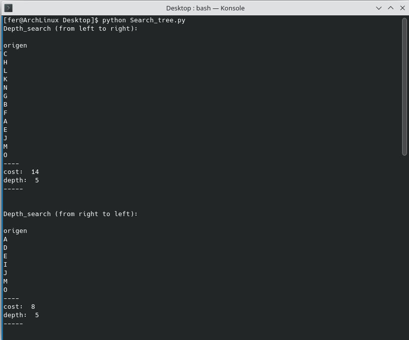
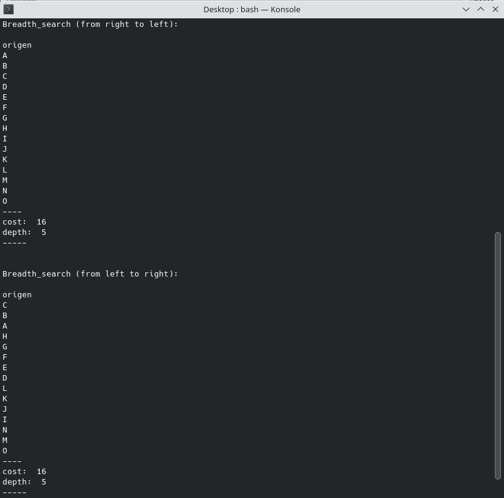

# search_tree
The purpose of this repo is to learn about different blind ***search tree*** methods and their differences.
Given a specific tree, starting from the root node ***'origen'***, the purpose is to achive the ***'O'*** node.

We are going to analyse 2 different methods:
* **Deapth-Search** (lifo stack):
  * from left to right
  * from right to left
* **Breadth-Search** (fifo stack):
  * from right to left
  * from left to right
And we are going to compare the cost differences between the proposed methods.
The cost of a method is defined by the number of nodes that are visited until the goal node is achieved.

## Comand
* python search_tree.py

## Conclusion
Here we can see the different paths that each method has followed and the associated cost.

As we can see, in this concrete case, the ***depth search from right to left*** is the most efficient search method.
